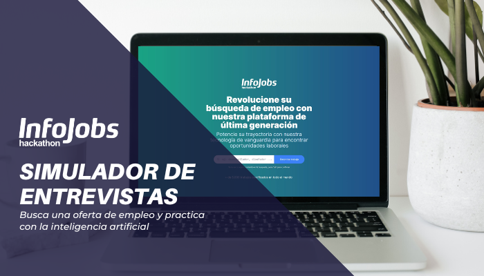

Ya puedes realizar tus primeras entevistas con la IA [Emulador de entrevistas](https://interview-simulator.net/).

En la era digital actual, la búsqueda de empleo se ha vuelto cada vez más competitiva y desafiante. Afortunadamente, la tecnología ha avanzado a pasos agigantados, ofreciendo soluciones innovadoras para simplificar el proceso de encontrar el trabajo ideal. En este contexto, me complace presentarte una aplicación web revolucionaria que combina lo mejor de ambos mundos: la plataforma de búsqueda de empleo InfoJobs y la simulación de entrevistas con inteligencia artificial.

## 💪 El poder de InfoJobs

InfoJobs es una plataforma reconocida a nivel mundial que conecta a empresas y candidatos en la búsqueda de empleo. Con miles de ofertas laborales disponibles en diversos sectores y empresas, es un recurso esencial para quienes buscan oportunidades profesionales. Sin embargo, destacarse entre la multitud de candidatos puede resultar desafiante y, en muchos casos, se requiere un proceso de selección riguroso y exigente.

## 🤖 La simulación de entrevistas como herramienta clave

Aquí es donde entra en juego nuestra aplicación web innovadora. Hemos desarrollado una herramienta que utiliza inteligencia artificial para brindar simulaciones de entrevistas, lo que te permite practicar y perfeccionar tus habilidades de entrevista antes de enfrentarte a la realidad. Esta herramienta te ofrece una experiencia cercana a una entrevista real, con preguntas específicas según tu campo laboral y el tipo de puesto que estás buscando.

## 😎 Beneficios de la simulación de entrevistas con inteligencia artificial

-   Entrenamiento personalizado: La inteligencia artificial adapta las preguntas y respuestas a tu perfil y preferencias, brindándote una experiencia personalizada para mejorar tus habilidades de entrevista.
-   Retroalimentación instantánea: Después de cada simulación, recibirás comentarios detallados y consejos prácticos sobre cómo mejorar tus respuestas, tu lenguaje corporal y tu comunicación en general.
-   Reducción de la ansiedad: Practicar con la inteligencia artificial te ayudará a reducir el estrés y la ansiedad asociados con las entrevistas reales, lo que te permitirá sentirte más seguro y preparado durante el proceso de selección.
-   Mejora de tus fortalezas y debilidades: La herramienta identificará tus puntos fuertes y áreas de mejora, lo que te permitirá trabajar en ellos antes de enfrentarte a entrevistas reales.
-   Ahorro de tiempo y recursos: Al utilizar la simulación de entrevistas en línea, podrás practicar desde la comodidad de tu hogar o cualquier lugar con acceso a internet, evitando desplazamientos innecesarios y optimizando tu tiempo.

## 🚀 Dónde puedes probar la aplicación ?

Para experimentar de primera mano la poderosa combinación de la plataforma de búsqueda de empleo InfoJobs y la simulación de entrevistas con inteligencia artificial, simplemente dirígete a nuestro sitio web: https://interview-simulator.net/

## 💻 Que recursos se han utilizado ?

He tenido la oportunidad de utilizar una variedad de recursos y tecnologías para desarrollar una aplicación web única y poderosa. Permíteme compartir contigo cómo he aprovechado cada uno de ellos:

-   API de InfoJobs: Utilicé la API de InfoJobs para acceder a su base de datos de ofertas laborales, proporcionando a los usuarios información actualizada y precisa sobre empleos y empresas.

-   Chat GPT: Implementé Chat GPT, un modelo de inteligencia artificial, para brindar respuestas inteligentes y conversaciones fluidas en tiempo real a los usuarios de la aplicación.

-   Next.js 13: Utilicé Next.js 13, una biblioteca de React.js, para crear una aplicación web rápida y eficiente, aprovechando la representación del lado del servidor y facilitando la construcción de páginas estáticas y dinámicas.

-   SuggestQueries de Google: Integré el servicio SuggestQueries de Google para ofrecer a los usuarios sugerencias predictivas mientras realizan búsquedas, agilizando el proceso de búsqueda de empleo y brindando resultados más efectivos.

## 👍 Conclusión

En resumen, nuestra aplicación web que combina la plataforma de búsqueda de empleo InfoJobs con simulaciones de entrevistas impulsadas por inteligencia artificial ofrece una solución integral para quienes buscan empleo. Te brinda la oportunidad de mejorar tus habilidades de entrevista, recibir retroalimentación valiosa y destacarte en el proceso de selección. Prepárate para enfrentar con confianza tus próximas entrevistas laborales y acércate un paso más a conseguir el trabajo de tus sueños. ¡No pierdas más tiempo y comienza a utilizar esta innovadora herramienta hoy mismo!
